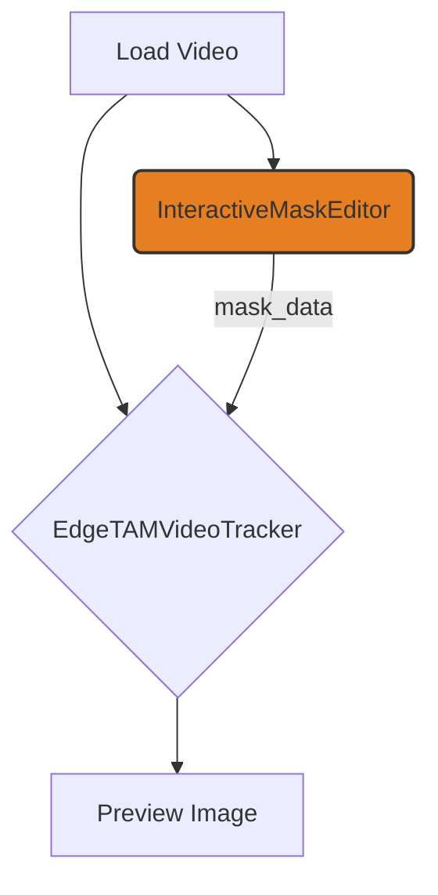

# ComfyUI EdgeTAM

A ComfyUI custom node implementation of EdgeTAM (On-Device Track Anything Model) for efficient, interactive video object tracking.

## Overview

EdgeTAM is an optimized variant of SAM 2 designed for on-device execution, running 22× faster than SAM 2 while maintaining high accuracy. This custom node provides a seamless and interactive workflow for video object segmentation and tracking within ComfyUI.

## Features

- **Interactive Video Object Tracking**: Pause the workflow at any time to draw a mask on the first frame of your video. The editor provides a live preview of the segmentation.
- **Automated Workflow Support**: For batch processing, you can bypass the interactive editor by providing a JSON string with pre-defined mask points.
- **High Performance**: Optimized for real-time inference on consumer hardware.
- **Automatic Installation**: The required EdgeTAM library and model checkpoint are automatically installed on the first run.

## Installation

1.  Clone this repository into your ComfyUI `custom_nodes` directory:
    ```bash
    cd ComfyUI/custom_nodes
    git clone https://github.com/your-repo/comfyui_EdgeTAM.git
    ```
2.  Restart ComfyUI. The necessary dependencies and the EdgeTAM model will be installed automatically the first time you run a workflow.

## Usage

This package provides two main nodes for a complete interactive tracking workflow.

### 1. Interactive Mask Editor

This node is the core of the interactive workflow.

-   **Inputs**:
    -   `image`: Connect the video frames (as an `IMAGE` batch) from a loader node.
    -   `optional_mask_data` (string): Leave this disconnected for interactive use. For automation, you can connect a string node containing a JSON object.
-   **Behavior**:
    -   **Interactive Mode**: When the workflow runs with the `optional_mask_data` input disconnected, it will pause and open a full-screen editor. Here you can:
        -   **Left-click** to add a positive ("include") point.
        -   **Right-click** to add a negative ("exclude") point.
        -   Use the **Preview Mask** button to see the segmentation result in real-time.
        -   Click **Save and Continue** to send the mask data to the next node.
    -   **Automation Mode**: If you provide a valid JSON string to the `optional_mask_data` input, the editor is skipped entirely. This is ideal for batch processing or when you want to programmatically define the mask. The JSON must have the following structure:
        ```json
        {
          "points": [[x1, y1], [x2, y2], ...],
          "labels": [1, 0, ...]
        }
        ```
        -   `points`: A list of `[x, y]` coordinate pairs.
        -   `labels`: A corresponding list where `1` is an include point and `0` is an exclude point.

### 2. EdgeTAM Video Tracker

This node performs the actual video tracking.

-   **Inputs**:
    -   `video_frames`: Connect the same video frames from your loader node.
    -   `mask_data`: Connect the `mask_data` output from the `InteractiveMaskEditor` node.
-   **Output**:
    -   `tracked_frames`: The original video frames.
    -   `masks`: The generated segmentation masks for each frame.
    -   `overlay_frames`: The original frames with the masks drawn on top.

### Example Workflow



## Requirements

-   Python >= 3.10
-   PyTorch >= 2.3.1
-   ComfyUI

## License

This project follows the EdgeTAM license (Apache 2.0). See the LICENSE file for details.

## Credits

Based on EdgeTAM by Meta Reality Labs:
-   Paper: "EdgeTAM: On-Device Track Anything Model" (CVPR 2025)
-   Repository: https://github.com/facebookresearch/EdgeTAM
